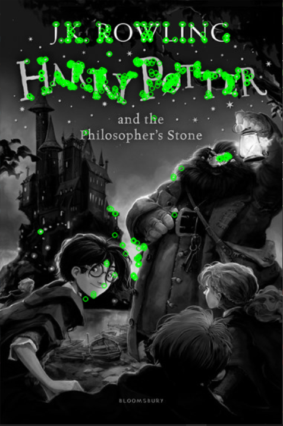
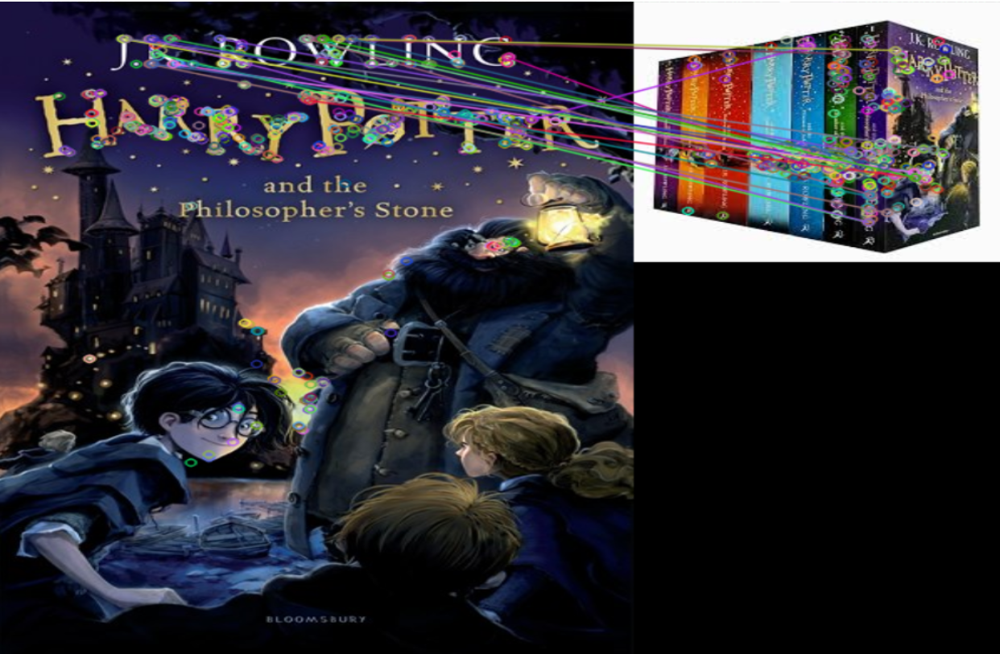
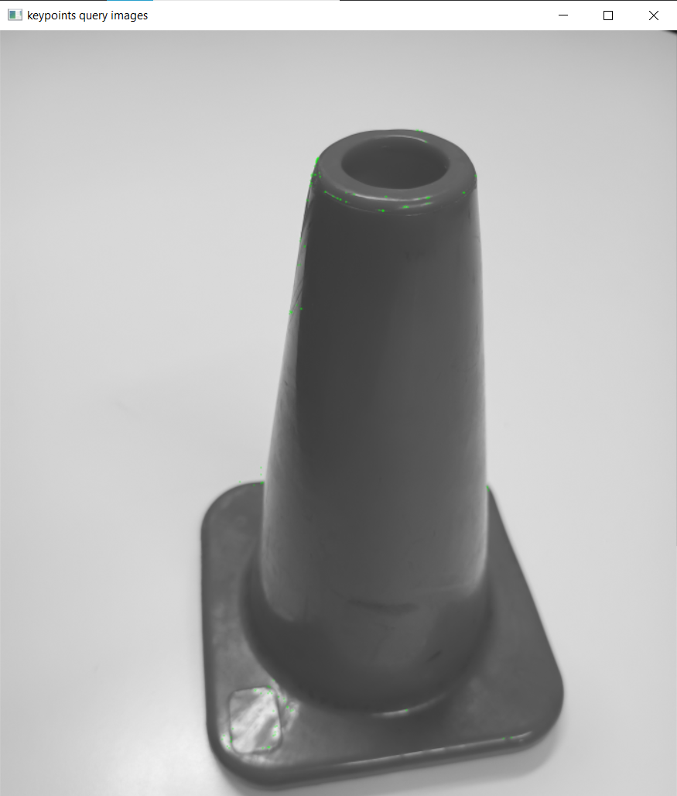
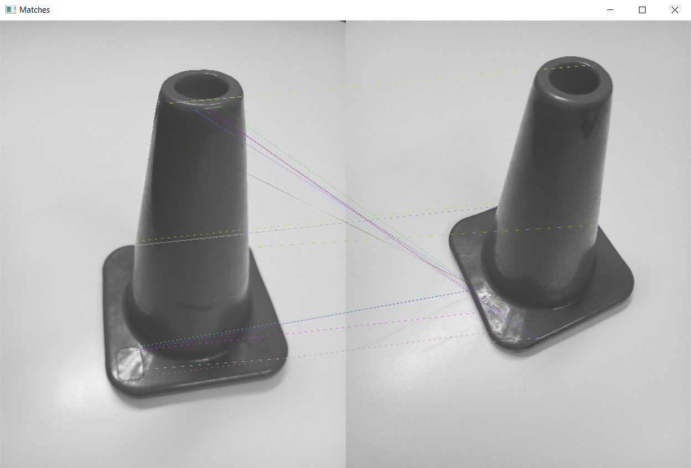
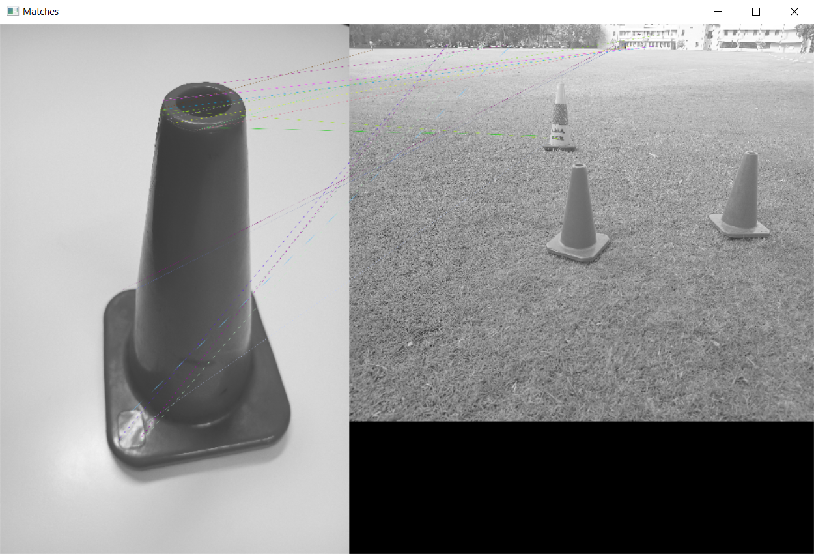

# Pioneer
Pioneer Robot Repository for UWA Mobile Robots.

# Pioneer Setup Summary
## 1. Github
To allow collaboration on the pioneers and for ease of transfer of work between pioneers.  
- [x]

## 2. Docker
For ease of setup of pioneers each time we work on them.  
- []  

## 3. Initial ROS
Pioneer is set up in the ROS environment, able to get a sim of the pioneer running.
- []

## 4. List out functionality and see if package exists
- [] ARIA https://roblab.org/courses/mobrob/project/general/ariaNode.zip 
- [] joy node: https://index.ros.org/p/joy/
- [] teleop_twist_joy: https://index.ros.org/p/teleop_twist_joy/github-ros2-teleop_twist_joy/ 
- [] Phidgets IMU node: http://wiki.ros.org/phidgets_imu (package may not work, use serial number for code on website to program directly)
- [] Transforms broadcasters for the sensors: http://wiki.ros.org/tf
- [] Nav stack setup: http://wiki.ros.org/navigation/Tutorials/RobotSetup
- [] Lidar - Sick Scan xd https://www.sick.com/fr/en/tim781-2174101/p/p594148 (make sure to include transform)
- [] Camera - DepthAI API: https://docs.luxonis.com/projects/sdk/en/latest/ Code Samples: https://docs.luxonis.com/projects/api/en/latest/tutorials/code_samples/

## 5. Graph out the system with nodes, topics and message types

## 6. Test Test Test

# Task Summary

## 1. Implement Bluetooth Communication
For safety, establish Bluetooth link between robot's PC and gamepad controller for manual instruction. Utilize gamepad buttons to switch between autonomous and manual modes.

## 2. Explore Unknown Area
Initiate exploration from a set home position, mapping the unknown area as the robot moves.

## 3. Image Recognition for Hand Drawn Numbers
Detect hand-drawn numbers scattered around the environment using image recognition. Note the number and its location.

## 4. Collision Avoidance with Lidar Sensor
Utilize Lidar sensor to prevent collisions with stationary objects within the environment.

## 5. Identify and Log Yellow or Red Obstacles
Capture photos and note locations of yellow or red obstacles, as they are of special interest to the team.
As we know that all of the red and yellow obstacles are red and yellow cones, the idea is to detect the shape of cones.
If a cone is detected, determine the colour of the cone.

What we could do:
During the exploration of the unknown environment:
1. While driving around and mapping, check if there is a cone.
2. If there is a cone, drive the robot to the cone and stop in e.g. 20cm distance.
3. Determine the colour of the cone (either red or yellow).
4. Calculate the location of the cone in the real world.
5. Save the location of the cone.

### Detect the cones:
#### Var 1: ORB (Orientation FAST and Rotated BRIEF):
ORB is a combination of FAST keypoint detector and BRIEF descriptor.
In brief, FAST is used to find the keypoints of an object.
Secondly, Harris corner measure is applied to find the top N keypoints.
In order to find the same object in a second image, the keypoints between the two images are matched by identifying their nearest neighbour.
The benefit of ORB is that it is roation-invariant and scale-invariant.

SIFT
https://docs.opencv.org/4.x/da/df5/tutorial_py_sift_intro.html

FAST
https://docs.opencv.org/4.x/df/d0c/tutorial_py_fast.html

ORB
https://www.geeksforgeeks.org/feature-detection-and-matching-with-opencv-python/?ref=lbp

I tried a mix of the code of
https://www.geeksforgeeks.org/feature-matching-using-orb-algorithm-in-python-opencv/?ref=lbp
and
https://docs.opencv.org/4.x/dc/dc3/tutorial_py_matcher.html

It works well with the Harry Potter book (*ConeDetection/ORB/detectHarryPotter.py*).

Sadly, detecting the cones (*ConeDetection/ORB/detect_Cone.py*) did not succeed.







#### Var 2: YOLO
YOLOv5 is the fifth iteration of the "You Only Look Once" object detection model that is known for its speed and accuracy.
The object detection problem is addressed using an end-to-end neural network.
All its predictions are made with the help of a single fully connected layer.
The code is based on https://github.com/jhan15/traffic_cones_detection/tree/master/images.

1. clone yolov5
```console
git clone https://github.com/ultralytics/yolov5  # 
cd yolov5
git reset --hard 886f1c03d839575afecb059accf74296fad395b6
```

2. install dependencies
```console
pip install -qr requirements.txt
```

3. clone https://github.com/jhan15/traffic_cones_detection/tree/master/images to another *directory2*

4. copy *model/best.pt* from *directory2* to the 1st repo in *yolov5/weights*

5. copy *utils/best.pt* from *directory2* to the 1st repo in *yolov5*

6. copy *utils/best.pt* from *directory2* to the 1st repo in *yolov5/utils*

7. Detect the cones in the pictures. Replace the last path with the path to the image.
```console
python detect.py --weights weights/best.pt --conf 0.6 --source C:\Users\49162\Documents\Uni\Master5_24_SS\MobileRobots\Project\pioneer\ConeDetection\ORB\Cones\queryCones
```
So far, *detect.py* shows the image with boxes around the cones, prints out how many cones are detected as well as the coordinates of the centres of the cones.

8. The images with boxes around the cones are saved to *runs\detect\exp*

**Results**
- Fallen cones are not detected.
- The cones that are not fallen are most of the times detected. But some of them are detected as yellow cones although they are red and some of the yellow cones are detected as green cones. --> check the colour again in a second step using the HSV value
- The tall cones are detected also as cones.


**To do/Questions**
- Test the code with the robot's camera.
- Ask if there are fallen cones --> yes
- Ask if there will be any other cones apart from the rather orange one and the yellow-green one --> yes: the orange tall cone and the red big bin
- Is the detection fast enough?

### Train a model with yolov5
good overview https://blog.paperspace.com/train-yolov5-custom-data/
- how to label the pictures: https://roboflow.com/formats/yolov5-pytorch-txt
Each image has one txt file with a single line for each bounding box. The format of each row is

class_id center_x center_y width height

where fields are space delimited, and the coordinates are normalized from zero to one.

Note: To convert to normalized xywh from pixel values, divide x (and width) by the image's width and divide y (and height) by the image's height.

- preprocessing of the images:
1. Auto-orient the images.

https://blog.roboflow.com/exif-auto-orientation/

How to do that? Is it necessary when using the robot's camera where we do not rotate the camera?

2. resize to 416x416

3. The following augmentation was applied to create 3 versions of each source image:
* Random rotation of between -15 and +15 degrees
* Random shear of between -10° to +10° horizontally and -10° to +10° vertically

Problem: crashes on windows, on linux not enough space.

### Detect objects by colour and shape:
The main script is *detectAll.py*.
The script *detectColour/identifyHSV.py* is used to check the colour of the object. Run the script and double click on all the points where you want to know the HSV value. The colour range for the
- orange little cones as well as the orange tall cones is [0, 85, 120] to [9, 255, 255] as well as [173,165,145] to [180,255,255],
- yellow cones is [19,160,150] to [30,255,255],
- red bins is [0, 155, 90] to [12, 255, 255].

**Difficulties**
- The colour ranges of the red bin and the orange (tall) cones overlap. When the orange colour is detected, also some parts of the red bins are detected. Those parts have unpredictable shapes and their geometry can be detected as an orange (tall) cone even if is is a red bin.
- If the ranges for red and orange colour are added together in order to avoid detecting little parts, also trees are detected and soil. As trees are very big this is dangerous and the red and orange colour range should not be combined.

The objects have different geometry that is used to distinguish between the objects.
One main differences is that the yellow and orange little cone rather look like triangles while the detected colour areas of the red bin and the orange tall cone rather look like rectangles.
As a first step, draw a contour around the detected area. As a second step, draw a triangle around this contour that has the minimum area. The more the contour is of shape triangle than rectangle, the smaller the area will be.


*The blue contour around the cone is contained in the triangle defined by the red circles.
The green rectangle around the cone is contained in the triangle defined by the green circles.
Dividing the area of the red triangle by the area of the green triangle gives a value smaller than 0.5*

Dividing the area of the triangle around a cone by the area of the triangle around a rectangle including the cone is around 0.35 to 0.41.
Thus, a constraint for a cone is that dividing the two areas is less than 0.5.
A constraint for a shape that rahter looks like a rectangle than a triangle is that dividing the areas gives a result of greater than 0.5.

**Geometric constraints**
- *orange little cone*: The detected orange contour is rather a triangle than a rectangle.
- yellow cone: The yellow cone consists of two yellow areas and one green area in the middle. Only detect one of the yellow areas.
- *orange tall cone*: The tall cones have a small width and a big height. The rotated rectangle that bounds the detected orange colour has a side-to-width ratio of at least 4:1.
- *big red bin*: The big red bin is rather a rectangle than a triangle.

The geometric constraints are implemented such that they are rotational invariant.
As a result, also e.g. fallen cones can be detected.

**Further strategies**

The objects are only detected if they have a certain size. If they are far away it is more likely that the detection fails and the objects in the distance are of less interest.
As the objects have different sizes, for each object the relative number of pixel areas that is needed to detect the object is defined.
Visually, the picture is divided into *N* equal parts. If the detected object is larger than the area of one part, it is detected.
The smaller the detected colour areas of the object, the bigger *N*.
- *orange little cone*: *N* = 256
- yellow cone: *N* = 256
- *orange tall cone*: *N* = 64
- *big red bin*: *N* = 16

In order to avoid false positives, at first the object detections are performed that are most reliable.
If first, a big red bin is detected and afterwards, a part of the red bin is detected as an orange little cone, the orange little cone is not added to the list of added objects because its area overlaps with the area of the red bin.
The objects are detected in the following order: yellow cones, red bins, orange tall cones, orange little cones.

**Results**

*Here, only near red orange little cones are detected. The colour of the tall orange cone and the red are also detected but their geometry does not match the desired geometry of an orange little cone. The left little orange cone is detected because it is near enough. The right little cone is not detected because it is a little smaller.*


*In this picture, all object detectors are turned on after each other. The yellow cone and the red big bin are detected because they are near. Some parts of the red bin are detected as orange but as the red bin is detected first, no other object can be detected in the area.
The orange cone in the distance is not detected because it is too far away.*


*This time, the orange tall cone is detected because it is near. Also two orange little cones are detected but not the two orange little cones in the distance.*


*The object detection is rotation invariant and also fallen cones are detected.*

## 6. Avoid Collision with Moving Obstacles
Implement collision avoidance with moving obstacles, triggering an emergency stop if an object comes within 1m of the robot.

## 7. Save Data in Case of Emergency Stop
Upon an emergency stop, save the last 5 seconds of recorded data for review by the team.

## 8. Print Map and Marker Details
After mapping the environment, print the map along with marker photos and locations on the screen.

## 9. Implement User Interface on Robot's Display
Create a user interface displaying the robot's internal state and intended actions on the robot's display.

## 10. Plan and Navigate to Waypoints
Given three waypoints marked by hand-drawn numbers, plan the fastest path to each waypoint and back to home. Navigate to these waypoints and return home in the fastest time possible.

## 11. Display Planned Path Graphically
Show the robot's planned path graphically on a screen.

## 12. Record Drives for Offline Review
Record drives for later review offline.