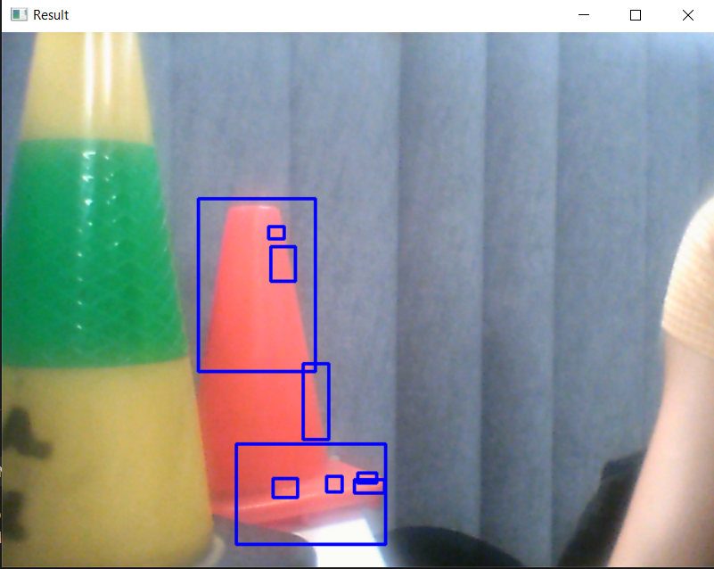
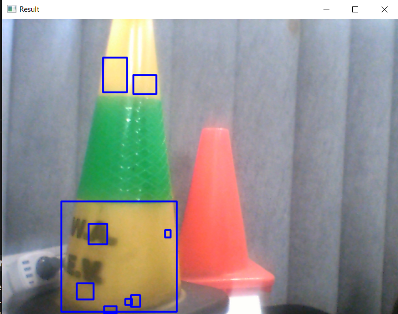

# Pioneer
Pioneer Robot Repository for UWA Mobile Robots.

# Pioneer Setup Summary
## 1. Github
To allow collaboration on the pioneers and for ease of transfer of work between pioneers.  
- [x]

## 2. Docker
For ease of setup of pioneers each time we work on them.  
- []  

## 3. Initial ROS
Pioneer is set up in the ROS environment, able to get a sim of the pioneer running.
- []

## 4. List out functionality and see if package exists
- [] ARIA https://roblab.org/courses/mobrob/project/general/ariaNode.zip 
- [] joy node: https://index.ros.org/p/joy/
- [] teleop_twist_joy: https://index.ros.org/p/teleop_twist_joy/github-ros2-teleop_twist_joy/ 
- [] Phidgets IMU node: http://wiki.ros.org/phidgets_imu (package may not work, use serial number for code on website to program directly)
- [] Transforms broadcasters for the sensors: http://wiki.ros.org/tf
- [] Nav stack setup: http://wiki.ros.org/navigation/Tutorials/RobotSetup
- [] Lidar - Sick Scan xd https://www.sick.com/fr/en/tim781-2174101/p/p594148 (make sure to include transform)
- [] Camera - DepthAI API: https://docs.luxonis.com/projects/sdk/en/latest/ Code Samples: https://docs.luxonis.com/projects/api/en/latest/tutorials/code_samples/

## 5. Graph out the system with nodes, topics and message types

## 6. Test Test Test

# Task Summary

## 1. Implement Bluetooth Communication
For safety, establish Bluetooth link between robot's PC and gamepad controller for manual instruction. Utilize gamepad buttons to switch between autonomous and manual modes.

## 2. Explore Unknown Area
Initiate exploration from a set home position, mapping the unknown area as the robot moves.

## 3. Image Recognition for Hand Drawn Numbers
Detect hand-drawn numbers scattered around the environment using image recognition. Note the number and its location.

## 4. Collision Avoidance with Lidar Sensor
Utilize Lidar sensor to prevent collisions with stationary objects within the environment.

## 5. Identify and Log Yellow or Red Obstacles
Capture photos and note locations of yellow or red obstacles, as they are of special interest to the team.
As we know that all of the red and yellow obstacles are red and yellow cones, the idea is to detect the shape of cones.
If a cone is detected, determine the colour of the cone.

What we could do:
During the exploration of the unknown environment:
1. While driving around and mapping, check if there is a cone.
2. If there is a cone, drive the robot to the cone and stop in e.g. 20cm distance.
3. Determine the colour of the cone (either red or yellow).
4. Calculate the location of the cone in the real world.
5. Save the location of the cone.

### Detect the cones:
#### Var 1: SIFT/ORB:
SIFT
https://docs.opencv.org/4.x/da/df5/tutorial_py_sift_intro.html

FAST
https://docs.opencv.org/4.x/df/d0c/tutorial_py_fast.html

ORB
https://www.geeksforgeeks.org/feature-detection-and-matching-with-opencv-python/?ref=lbp

I tried a mix of the code of
https://www.geeksforgeeks.org/feature-matching-using-orb-algorithm-in-python-opencv/?ref=lbp
and
https://docs.opencv.org/4.x/dc/dc3/tutorial_py_matcher.html

It works well with the Harry Potter book (*ConeDetection/ORB/detectHarryPotter.py*).

Sadly, detecting the cones (*ConeDetection/ORB/detect_Cone.py*) did not succeed.

#### Var 2: Yolo

### Detect the colour:
The RGB Image is converted to an HSV Image.
The lower bound of red is [160,50,50] and the upper bound is [180,255,255].
The script *detectColour/detectRedColourVideo.py* detects red areas in the webcam video if they are bigger than a threshold (this threshold must be adapted for the smaller 28x28 image).

The lower bound of yellow is [20,100,100] and the upper bound is [[30,255,255].
The script *ConeDetection/detectColour/detectYellowColourVideo.py* detects yellow areas if they are bigger than a threshold.

The website https://cvexplained.wordpress.com/2020/04/28/color-detection-hsv/ also provides code for capturing an object in real time using cv2.resize.
Do we need that if we only have 28x28 pixels?

## 6. Avoid Collision with Moving Obstacles
Implement collision avoidance with moving obstacles, triggering an emergency stop if an object comes within 1m of the robot.

## 7. Save Data in Case of Emergency Stop
Upon an emergency stop, save the last 5 seconds of recorded data for review by the team.

## 8. Print Map and Marker Details
After mapping the environment, print the map along with marker photos and locations on the screen.

## 9. Implement User Interface on Robot's Display
Create a user interface displaying the robot's internal state and intended actions on the robot's display.

## 10. Plan and Navigate to Waypoints
Given three waypoints marked by hand-drawn numbers, plan the fastest path to each waypoint and back to home. Navigate to these waypoints and return home in the fastest time possible.

## 11. Display Planned Path Graphically
Show the robot's planned path graphically on a screen.

## 12. Record Drives for Offline Review
Record drives for later review offline.